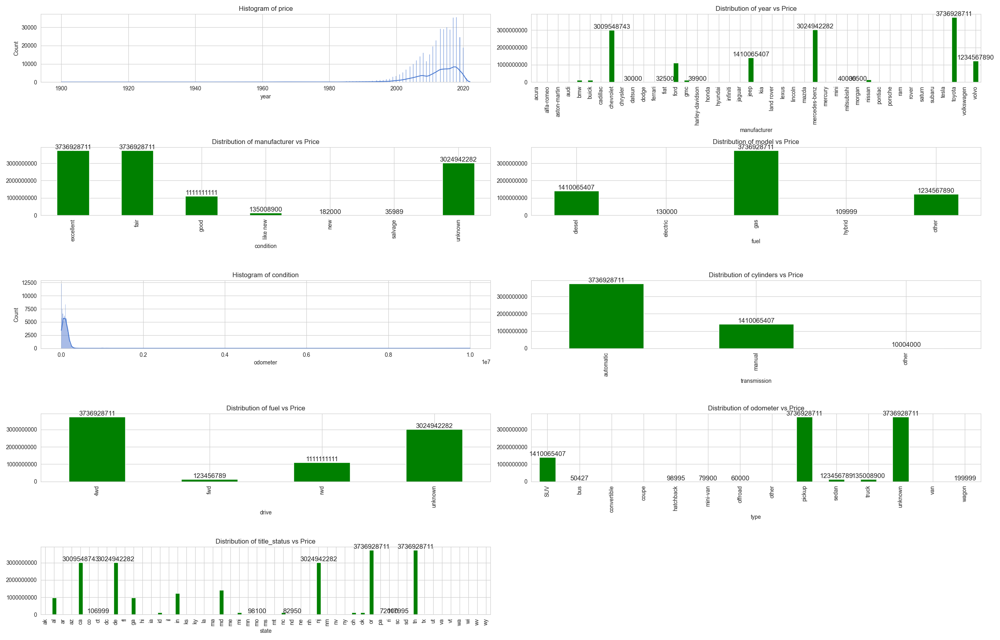
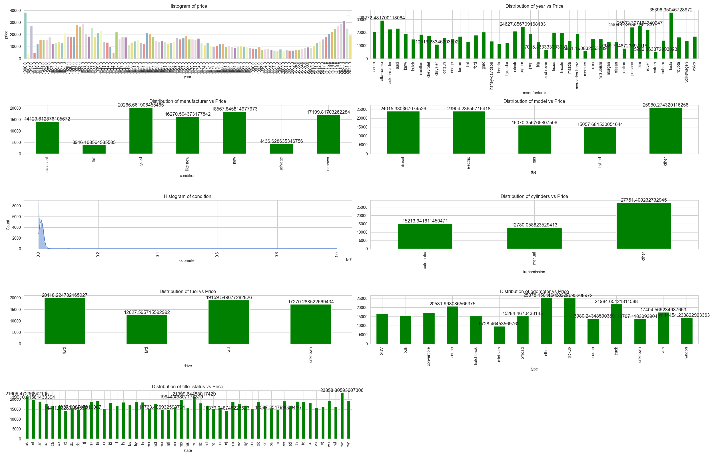
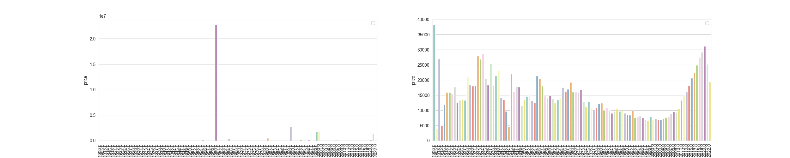
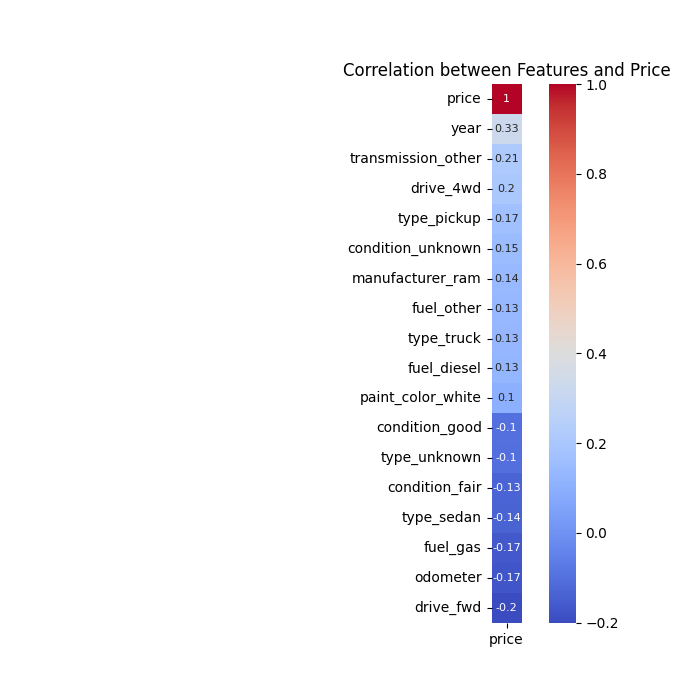

<h1>Data Problem Definition:</h1>

Identify the key predictive factors that influence the sale price of used cars using a dataset of 426,000 vehicle records.
Specifically, develop a regression model that explains the variation in sale price based on various attributes such as manufacturer, model, year, odometer, condition, and other relevant features.
 
The goal is to extract insights on the relationships between these attributes and sale price, ultimately informing feature importance and driving business recommendations for the used car dealership. 

<h2>Key Objectives:</h2>
<ul>
<li>
            Identify significant predictors of used car sale price.
</li>
<li>
            Quantify the relationships between predictors and sale price.
</li>
<li>
            Rank features by importance to inform business decisions.
</li>
</ul>
<h2>Technical Requirements:</h2>
<ul>
        <li>
            Data preprocessing and feature engineering
        </li>
        <li>
            Regression modeling (e.g., linear, generalized linear, or tree-based)
        </li>
        <li>
            Feature selection and importance analysis
        </li>
        <li>
            Model evaluation and validation
        </li>
    </ul>

        This reframed definition provides a clear direction for the data analysis task, focusing on identifying key drivers of used car prices using regression modeling and feature importance analysis.
    

<!---->

    <h1>Data Understanding Steps</h1>

        I will use the following steps to get familiar with the dataset and identify quality issues:  
    

<ul>
<li>
    Step 1: Initial Data Review
    <ul>
        <li>
            Check the dataset's dimensions (number of rows, columns)
        </li>
        <li>
            Review the data types for each column (numeric, categorical, date, etc.)
        </li>
    </ul>
</li>
<li>
    Step 2: Summary Statistics
    <ul>
        <li>
            Calculate summary statistics for numeric columns (mean, median, mode, min, max, std dev)
        </li>
        <li>
            Generate frequency distributions for categorical columns
        </li>
    </ul>
</li>
<li>
    Step 3: Data Visualization
    <ul>
        <li>
            Plot histograms or density plots for numeric columns
        </li>
        <li>
            Create bar charts or pie charts for categorical columns
        </li>
        <li>
            Use scatter plots or correlation matrices to explore relationships between columns
        </li>
    </ul>
</li>
<li>
    Step 4: Missing Value Analysis
    <ul>
        <li>
            Identify columns with missing values
        </li>
        <li>
            Calculate the percentage of missing values for each column
        </li>
        <li>
            Determine the pattern of missing values (random, systematic)
        </li>
    </ul>
</li>
<li>
    Step 5: Data Quality Checks
    <ul>
        <li>
            Check for invalid or inconsistent values
        </li>
        <li>
            Identify duplicates or redundant records
        </li>
        <li>
            Verify data formats (e.g., date, time, categorical)
        </li>
    </ul>
</li>
<li>
    Step 6: Correlation Analysis
    <ul>
        <li>
            Calculate pairwise correlations between numeric columns
        </li>
        <li>
            Identify highly correlated columns
        </li>
    </ul>
</li>
<li>
    Step 7: Data Profiling
    <ul>
        <li>
            Create a data profile report summarizing the findings
        </li>
        <li>
            Document data quality issues, inconsistencies, and areas for improvement        <ul>
        </li>
    </ul>
</li>
</ul>
 

Here is the information of the raw data:

 

<table style="border-collapse: collapse; width: 50%; border-radius: 10px; overflow: hidden;margin:auto;background-color:white;">
    <thead style="background-color: #f0f0f0; border-bottom: 1px solid #ddd;">
        <tr style="text-align: right;">
            <th style="padding: 10px; border-right: 1px solid #ddd;">Column</th>
            <th style="padding: 10px;">Non-Null Count</th>
            <th style="padding: 10px;">Null Counts</th>
            <th style="padding: 10px;">Percent</th>
            <th style="padding: 10px;">Dtype</th>
        </tr>
    </thead>
    <tbody>
        <tr>
            <td style="padding:10px;border-top:none;border-bottom:1px solid #ddd;border-right:1px solid #ddd;">id</td>
            <td style="padding:10px;border-top:none;border-bottom:1px solid #ddd;border-right:1px solid #ddd;">426880</td>
            <td style="padding:10px;border-top:none;border-bottom:1px solid #ddd;border-right:1px solid #ddd;">0</td>
            <td style="padding:10px;border-top:none;border-bottom:1px solid #ddd;border-right:1px solid #ddd;">0.000000</td>
            <td style="padding:10px;border-top:none;border-bottom:1px solid #ddd;border-right:1px solid #ddd;">int64</td>
        </tr>
        <tr>
            <td style="padding:10px;border-top:none;border-bottom:1px solid #ddd;border-right:1px solid #ddd;">region</td>
            <td style="padding:10px;border-top:none;border-bottom:1px solid #ddd;border-right:1px solid #ddd;">426880</td>
            <td style="padding:10px;border-top:none;border-bottom:1px solid #ddd;border-right:1px solid #ddd;">0</td>
            <td style="padding:10px;border-top:none;border-bottom:1px solid #ddd;border-right:1px solid #ddd;">0.000000</td>
            <td style="padding:10px;border-top:none;border-bottom:1px solid #ddd;border-right:1px solid #ddd;">object</td>
        </tr>
        <tr>
            <td style="padding:10px;border-top:none;border-bottom:1px solid #ddd;border-right:1px solid #ddd;">price</td>
            <td style="padding:10px;border-top:none;border-bottom:1px solid #ddd;border-right:1px solid #ddd;">426880</td>
            <td style="padding:10px;border-top:none;border-bottom:1px solid #ddd;border-right:1px solid #ddd;">0</td>
            <td style="padding:10px;border-top:none;border-bottom:1px solid #ddd;border-right:1px solid #ddd;">0.000000</td>
            <td style="padding:10px;border-top:none;border-bottom:1px solid #ddd;border-right:1px solid #ddd;">int64</td>
        </tr>
        <tr>
            <td style="padding:10px;border-top:none;border-bottom:1px solid #ddd;border-right:1px solid #ddd;">year</td>
            <td style="padding:10px;border-top:none;border-bottom:1px solid #ddd;border-right:1px solid #ddd;">425675</td>
            <td style="padding:10px;border-top:none;border-bottom:1px solid #ddd;border-right:1px solid #ddd;">1205</td>
            <td style="padding:10px;border-top:none;border-bottom:1px solid #ddd;border-right:1px solid #ddd;">0.282281</td>
            <td style="padding:10px;border-top:none;border-bottom:1px solid #ddd;border-right:1px solid #ddd;">float64</td>
        </tr>
        <tr>
            <td style="padding:10px;border-top:none;border-bottom:1px solid #ddd;border-right:1px solid #ddd;">manufacturer</td>
            <td style="padding:10px;border-top:none;border-bottom:1px solid #ddd;border-right:1px solid #ddd;">409234</td>
            <td style="padding:10px;border-top:none;border-bottom:1px solid #ddd;border-right:1px solid #ddd;">17646</td>
            <td style="padding:10px;border-top:none;border-bottom:1px solid #ddd;border-right:1px solid #ddd;">4.133714</td>
            <td style="padding:10px;border-top:none;border-bottom:1px solid #ddd;border-right:1px solid #ddd;">object</td>
        </tr>
        <tr>
            <td style="padding:10px;border-top:none;border-bottom:1px solid #ddd;border-right:1px solid #ddd;">model</td>
            <td style="padding:10px;border-top:none;border-bottom:1px solid #ddd;border-right:1px solid #ddd;">421603</td>
            <td style="padding:10px;border-top:none;border-bottom:1px solid #ddd;border-right:1px solid #ddd;">5277</td>
            <td style="padding:10px;border-top:none;border-bottom:1px solid #ddd;border-right:1px solid #ddd;">1.236179</td>
            <td style="padding:10px;border-top:none;border-bottom:1px solid #ddd;border-right:1px solid #ddd;">object</td>
        </tr>
        <tr>
            <td style="padding:10px;border-top:none;border-bottom:1px solid #ddd;border-right:1px solid #ddd;">condition</td>
            <td style="padding:10px;border-top:none;border-bottom:1px solid #ddd;border-right:1px solid #ddd;">252776</td>
            <td style="padding:10px;border-top:none;border-bottom:1px solid #ddd;border-right:1px solid #ddd;">174104</td>
            <td style="padding:10px;border-top:none;border-bottom:1px solid #ddd;border-right:1px solid #ddd;">40.785232</td>
            <td style="padding:10px;border-top:none;border-bottom:1px solid #ddd;border-right:1px solid #ddd;">object</td>
        </tr>
        <tr>
            <td style="padding:10px;border-top:none;border-bottom:1px solid #ddd;border-right:1px solid #ddd;">cylinders</td>
            <td style="padding:10px;border-top:none;border-bottom:1px solid #ddd;border-right:1px solid #ddd;">249202</td>
            <td style="padding:10px;border-top:none;border-bottom:1px solid #ddd;border-right:1px solid #ddd;">177678</td>
            <td style="padding:10px;border-top:none;border-bottom:1px solid #ddd;border-right:1px solid #ddd;">41.622470</td>
            <td style="padding:10px;border-top:none;border-bottom:1px solid #ddd;border-right:1px solid #ddd;">object</td>
        </tr>
        <tr>
            <td style="padding:10px;border-top:none;border-bottom:1px solid #ddd;border-right:1px solid #ddd;">fuel</td>
            <td style="padding:10px;border-top:none;border-bottom:1px solid #ddd;border-right:1px solid #ddd;">423867</td>
            <td style="padding:10px;border-top:none;border-bottom:1px solid #ddd;border-right:1px solid #ddd;">3013</td>
            <td style="padding:10px;border-top:none;border-bottom:1px solid #ddd;border-right:1px solid #ddd;">0.705819</td>
            <td style="padding:10px;border-top:none;border-bottom:1px solid #ddd;border-right:1px solid #ddd;">object</td>
        </tr>
        <tr>
            <td style="padding:10px;border-top:none;border-bottom:1px solid #ddd;border-right:1px solid #ddd;">odometer</td>
            <td style="padding:10px;border-top:none;border-bottom:1px solid #ddd;border-right:1px solid #ddd;">422480</td>
            <td style="padding:10px;border-top:none;border-bottom:1px solid #ddd;border-right:1px solid #ddd;">4400</td>
            <td style="padding:10px;border-top:none;border-bottom:1px solid #ddd;border-right:1px solid #ddd;">1.030735</td>
            <td style="padding:10px;border-top:none;border-bottom:1px solid #ddd;border-right:1px solid #ddd;">float64</td>
        </tr>
        <tr>
            <td style="padding:10px;border-top:none;border-bottom:1px solid #ddd;border-right:1px solid #ddd;">title_status</td>
            <td style="padding:10px;border-top:none;border-bottom:1px solid #ddd;border-right:1px solid #ddd;">418638</td>
            <td style="padding:10px;border-top:none;border-bottom:1px solid #ddd;border-right:1px solid #ddd;">8242</td>
            <td style="padding:10px;border-top:none;border-bottom:1px solid #ddd;border-right:1px solid #ddd;">1.930753</td>
            <td style="padding:10px;border-top:none;border-bottom:1px solid #ddd;border-right:1px solid #ddd;">object</td>
        </tr>
        <tr>
            <td style="padding:10px;border-top:none;border-bottom:1px solid #ddd;border-right:1px solid #ddd;">transmission</td>
            <td style="padding:10px;border-top:none;border-bottom:1px solid #ddd;border-right:1px solid #ddd;">424324</td>
            <td style="padding:10px;border-top:none;border-bottom:1px solid #ddd;border-right:1px solid #ddd;">2556</td>
            <td style="padding:10px;border-top:none;border-bottom:1px solid #ddd;border-right:1px solid #ddd;">0.598763</td>
            <td style="padding:10px;border-top:none;border-bottom:1px solid #ddd;border-right:1px solid #ddd;">object</td>
        </tr>
        <tr>
            <td style="padding:10px;border-top:none;border-bottom:1px solid #ddd;border-right:1px solid #ddd;">VIN</td>
            <td style="padding:10px;border-top:none;border-bottom:1px solid #ddd;border-right:1px solid #ddd;">265838</td>
            <td style="padding:10px;border-top:none;border-bottom:1px solid #ddd;border-right:1px solid #ddd;">161042</td>
            <td style="padding:10px;border-top:none;border-bottom:1px solid #ddd;border-right:1px solid #ddd;">37.725356</td>
            <td style="padding:10px;border-top:none;border-bottom:1px solid #ddd;border-right:1px solid #ddd;">object</td>
        </tr>
        <tr>
            <td style="padding:10px;border-top:none;border-bottom:1px solid #ddd;border-right:1px solid #ddd;">drive</td>
            <td style="padding:10px;border-top:none;border-bottom:1px solid #ddd;border-right:1px solid #ddd;">296313</td>
            <td style="padding:10px;border-top:none;border-bottom:1px solid #ddd;border-right:1px solid #ddd;">130567</td>
            <td style="padding:10px;border-top:none;border-bottom:1px solid #ddd;border-right:1px solid #ddd;">30.586347</td>
            <td style="padding:10px;border-top:none;border-bottom:1px solid #ddd;border-right:1px solid #ddd;">object</td>
        </tr>
        <tr>
            <td style="padding:10px;border-top:none;border-bottom:1px solid #ddd;border-right:1px solid #ddd;">size</td>
            <td style="padding:10px;border-top:none;border-bottom:1px solid #ddd;border-right:1px solid #ddd;">120519</td>
            <td style="padding:10px;border-top:none;border-bottom:1px solid #ddd;border-right:1px solid #ddd;">306361</td>
            <td style="padding:10px;border-top:none;border-bottom:1px solid #ddd;border-right:1px solid #ddd;">71.767476</td>
            <td style="padding:10px;border-top:none;border-bottom:1px solid #ddd;border-right:1px solid #ddd;">object</td>
        </tr>
        <tr>
            <td style="padding:10px;border-top:none;border-bottom:1px solid #ddd;border-right:1px solid #ddd;">type</td>
            <td style="padding:10px;border-top:none;border-bottom:1px solid #ddd;border-right:1px solid #ddd;">334022</td>
            <td style="padding:10px;border-top:none;border-bottom:1px solid #ddd;border-right:1px solid #ddd;">92858</td>
            <td style="padding:10px;border-top:none;border-bottom:1px solid #ddd;border-right:1px solid #ddd;">21.752717</td>
            <td style="padding:10px;border-top:none;border-bottom:1px solid #ddd;border-right:1px solid #ddd;">object</td>
        </tr>
        <tr>
            <td style="padding:10px;border-top:none;border-bottom:1px solid #ddd;border-right:1px solid #ddd;">paint_color</td>
            <td style="padding:10px;border-top:none;border-bottom:1px solid #ddd;border-right:1px solid #ddd;">296677</td>
            <td style="padding:10px;border-top:none;border-bottom:1px solid #ddd;border-right:1px solid #ddd;">130203</td>
            <td style="padding:10px;border-top:none;border-bottom:1px solid #ddd;border-right:1px solid #ddd;">30.501078</td>
            <td style="padding:10px;border-top:none;border-bottom:1px solid #ddd;border-right:1px solid #ddd;">object</td>
        </tr>
        <tr>
            <td style="padding:10px;border-top:none;border-bottom:1px solid #ddd;border-right:1px solid #ddd;">state</td>
            <td style="padding:10px;border-top:none;border-bottom:1px solid #ddd;border-right:1px solid #ddd;">426880</td>
            <td style="padding:10px;border-top:none;border-bottom:1px solid #ddd;border-right:1px solid #ddd;">0</td>
            <td style="padding:10px;border-top:none;border-bottom:1px solid #ddd;border-right:1px solid #ddd;">0.000000</td>
            <td style="padding:10px;border-top:none;border-bottom:1px solid #ddd;border-right:1px solid #ddd;">object</td>
        </tr>
    </tbody>
</table>

            Based on the table above, it is clear that some features contain null values. Notably, some of these null values exceed the actual non-null values, such as in the case of the "size" feature. As a result, these null values are not worth retaining, as they will skew the data.
             
            As a general guideline, we will retain features with fewer than 50% null values. Later, we will decide whether to fill in the null values with the highest value for each feature, or with a placeholder such as "missing" or "unknown".

<h2>Histogram and Distribution</h2>

    The following graphs are presented in two separate categories:  
    <h3>Numerical Features: Histograms</h3>
    These graphs display the distribution of numerical features through histograms, providing a visual representation of the data's central tendency, dispersion, and shape.
     
    <h3>Categorical Features: Grouped Distributions</h3>
    These graphs illustrate the relationship between categorical features and the target variable (price) by showing the grouped distribution of the feature versus the price. This allows for an examination of how different categories impact the price, enabling insights into potential outliers and patterns.
     
    By visualizing the grouped distribution, we can identify:
    <ol>
        <li>
            Categories with exceptionally high or low prices
        </li>
        <li>
            Categories with limited or excessive price variability
        </li>
    </ol>
    This analysis facilitates a deeper understanding of the complex relationships between categorical features and the target variable, ultimately supporting more informed decision-making.

    

<h2>Initial Observations and Data Quality Concerns</h2>

    Upon examining the grouped distributions, it is readily apparent that the data contains:
    <ol>
        <li>
            Outliers and erroneous information - like the 10 digit chevrolet or the 1234567890 volvo -, which can significantly compromise the accuracy and reliability of any subsequent analysis
        </li>
        <li>
            A significantly uneven distribution between manufacturers, with some having a disproportionately large or small number of data points
        </li>
    </ol>
    <h3>
        Need for Data Cleansing
    </h3>
    To ensure the integrity of our analysis, it is essential to perform a thorough data cleansing exercise to:
    <ol>
        <li>
            Identify and remove outliers that may skew the results
        </li>
        <li>
            Correct or eliminate erroneous or invalid data points
        </li>
        <li>
            Handle missing values or inconsistencies
        </li>
    </ol>
    By doing so, we can enhance the quality and reliability of the data, thereby supporting more robust and meaningful insights. This crucial step will enable us to build a stronger foundation for our analysis and mitigate potential risks associated with flawed data.

<h1>Data Preparation</h1>

 Following an in-depth analysis of the data, I identified several initiatives to cleanse and preprocess the data for further analysis. The steps I took are outlined below:
 <h4>Feature Selection and Removal</h4>
 I dropped the following features to minimize redundancy and optimize the dataset:
<ol>
<li>
    id
</li>
<li>
    VIN
</li>
<li>
    size
</li>
<li>
    region
</li>
</ol>
<h4>Handling Missing Values</h4>
 To ensure data quality, I removed rows with null values in the following critical features:
<ol>
<li>
    year
</li>
<li>
    manufacturer
</li>
</ol>
<h4>Imputation of Missing Values</h4>
For the remaining features with null values, I applied the following imputation strategies:
<ol>
<li>
    Fuel: replaced with "gas"
</li>
<li>
    title_status: replaced with "missing"
</li>
<li>
    drive: replaced with "unknown"
</li>
<li>
    paint_color: replaced with "unknown"
</li>
<li>
    condition: replaced with "unknown"
</li>
<li>
    type: replaced with "unknown"
</li>
</ol>
<h4>Outlier Removal</h4>
To prevent skewness and ensure robust analysis, I removed the bottom 10% and top 5% of values in the price feature, effectively eliminating outliers.
  
These data preparation steps enabled me to create a cleaner, more reliable dataset for subsequent analysis and modeling.
The results can be seen in the following graph:

    

<h2>Result Analysis</h2>

<h3>Improved Data Distribution</h3>
As evident from the graphs, our data now exhibits a more even distribution. This is consistently observed across all graphs, with the manufacturer vs. price graph serving as a prime example. Here, we can see that the prices for each manufacturer are now more evenly distributed, indicating the removal of the most prominent outliers.
<h3>Enhanced Price Analysis</h3>
The price graph is now displaying different information. Previously, it displayed a simple price histogram. Now, it showcases a price vs. year distribution, revealing the average prices across all years. This new representation uncovers a cyclical pattern and a discernible trend, offering valuable insights into price fluctuations over time.
<h3>Comparative Analysis</h3>
The graph below provides a direct comparison between the original data vs. year and the cleansed data vs. year. At a glance, we can appreciate the significant improvement in data distribution. The cleansed data, now more evenly distributed, will serve as the foundation for further analysis, enabling more accurate and reliable conclusions.

    

<h2>Data Preparation</h2>
Now that we have thoroughly cleansed the data, we can proceed to prepare it for further analysis, focusing particularly on the categorical features.
<h3>Encoding Categorical Features</h3>
To facilitate analysis, I applied the following encoding techniques:
<ol>
<li>
    One Hot Encoding: For the features with multiple categories, I used One Hot Encoding to create binary vectors:
    <ul>
<li>
    Manufacturer
</li>
<li>
    Transmission
</li>
<li>
    paint_color
</li>
<li>
    state
</li>
<li>
    fuel
</li>
<li>
    title_status
</li>
<li>
    drive
</li>
<li>
    type
</li>
<li>
    condition
</li>
    </ul>
</li>
</ol>

<h3>Data Preparation and Encoding</h3>

    The data preparation and encoding process was accomplished utilizing a Python script, which generated a new CSV file incorporating all the specified conditions. This script implemented data cleansing recommendations and applied encoding techniques to all categorical features, ensuring optimal data quality and readiness for analysis.

The "model" feature was excluded from the analysis due to its high cardinality (thousands of unique values). One-hot encoding this feature would have introduced an impractically large number of columns, complicating data manipulation without significantly enhancing model performance. Therefore, it was removed from the dataset.           

<h2>Correlation Analysis</h2>

    With the encoded data, I conducted a correlation analysis to identify relationships between features. The most salient features, driving the model's performance, are:

    

<h3>Key Findings</h3>

    The correlation analysis revealed the following insights:

<ol>
<li>
High Positive Correlations: The features with the strongest positive correlations are:
<ul>
<li>
    year
</li>
<li>
    transmission_other
</li>
<li>
    drive_4wd
</li>
</ul>
</li>
<li>
    High Negative Correlations: The features with the strongest negative correlations are:
<ul>
<li>
    drive_fwd
</li>
<li>
    odometer
</li>
<li>
    fuel_gas
</li>
</ul>
</li>
</ol>
<h3>Next Steps</h3>
With these insights and the transformed data, we can now proceed to select a suitable algorithm and forecast the price with increased accuracy.

<h1>Selecting the model</h1>

<h1>Model Selection and Evaluation</h1>

    To identify the most accurate model, I evaluated three distinct regression models, each with its strengths and weaknesses. The selected models were:

<ol>
    <li>
        Ridge Regression: A linear regression model that uses L2 regularization to reduce overfitting by minimizing the magnitude of model coefficients.
    </li>
    <li>
        Sequential Feature Selector (SFS): A feature selection algorithm that iteratively selects the most relevant features, optimizing model performance while reducing dimensionality.
    </li>
    <li>
        Recursive Feature Elimination (RFE): A feature selection technique that recursively eliminates the least important features, ranking them based on model coefficients.
    </li>
</ol>

    The objective of this evaluation was twofold:

<ul>
    <li>
        Achieve a balance between Mean Squared Error (MSE) and feature magnitude, ensuring accurate predictions while minimizing overfitting.
    </li>
    <li>
        Identify the coefficients of each feature, enabling the analysis of their impact on car prices.
    </li>
</ul>

    By comparing the performance of these models, we can determine which one provides the most insightful and accurate predictions, ultimately informing data-driven decisions.
     

<h3>Model Evaluation</h3>

    Three regression models were assessed to optimize accuracy:

<ul>
    <li>
        Ridge Regression (regularized linear regression)
    </li>
    <li>
        Sequential Feature Selector (iterative feature selection)
    </li>
    <li>
        Recursive Feature Elimination (recursive feature ranking)
    </li>
</ul>

    The goals were:

<ul>
    <li>
        Balance MSE and feature magnitude for accurate predictions.
    </li>
    <li>
        Identify feature coefficients to analyze their impact on car prices.
    </li>
</ul>

    This evaluation enables informed decision-making by identifying the most effective model.

    The result of the evaluation can be found in the following table:

<table style="border-collapse: collapse; width: 50%; border-radius: 10px; overflow: hidden; margin: auto; background-color: white;">
<thead style="background-color: #f0f0f0; border-bottom: 1px solid #ddd;">
<tr style="text-align: right;">
<th style="padding: 10px; border-right: 1px solid #ddd;">Model</th>
<th style="padding: 10px;">Pipeline</th>
<th style="padding: 10px;">Magnitude</th>
<th style="padding: 10px;">features</th>
<th style="padding: 10px;">coeficients</th>
<th style="padding: 10px;">MSE</th>
</tr>
</thead>
<tbody style="border: 1px solid #ddd;">
<tr>
<th rowspan="34" style="padding:10px;border-top:none;border-bottom:1px solid #ddd;border-right:1px solid #ddd;">Ridge</th>
<td rowspan="34" style="padding:10px;border-top:none;border-bottom:1px solid #ddd;border-right:1px solid #ddd;">(StandardScaler(), Ridge())</td>
<td rowspan="34" style="padding:10px;border-top:none;border-bottom:1px solid #ddd;border-right:1px solid #ddd;">38786.64</td>
<td>year</td>
<td>2968.634538</td>
<td rowspan="34" style="padding:10px;border-top:none;border-bottom:1px solid #ddd;border-right:1px solid #ddd;">56792448.45</td>
</tr>
<tr>
    <td>transmission_other</td>
    <td>1424.988676</td>
</tr>
<tr>
    <td>condition_unknown</td>
    <td>958.700289</td>
</tr>
<tr>
    <td>drive_4wd</td>
    <td>878.634051</td>
</tr>
<tr>
    <td>type_pickup</td>
    <td>829.120512</td>
</tr>
<tr>
    <td>type_truck</td>
    <td>751.913622</td>
</tr>
<tr>
    <td>drive_rwd</td>
    <td>561.780138</td>
</tr>
<tr>
    <td>fuel_diesel</td>
    <td>517.359302</td>
</tr>
<tr>
    <td>condition_like new</td>
    <td>497.296397</td>
</tr>
<tr>
    <td>manufacturer_ram</td>
    <td>487.068544</td>
</tr>
<tr>
    <td>type_coupe</td>
    <td>478.041636</td>
</tr>
<tr>
    <td>type_other</td>
    <td>461.082152</td>
</tr>
<tr>
    <td>manufacturer_tesla</td>
    <td>452.832429</td>
</tr>
<tr>
    <td>state_hi</td>
    <td>434.721513</td>
</tr>
<tr>
    <td>state_pa</td>
    <td>-306.020015</td>
</tr>
<tr>
    <td>manufacturer_kia</td>
    <td>-309.120851</td>
</tr>
<tr>
    <td>manufacturer_chrysler</td>
    <td>-310.464049</td>
</tr>
<tr>
    <td>manufacturer_subaru</td>
    <td>-314.384515</td>
</tr>
<tr>
    <td>manufacturer_saturn</td>
    <td>-317.625618</td>
</tr>
<tr>
    <td>type_hatchback</td>
    <td>-323.774648</td>
</tr>
<tr>
    <td>type_unknown</td>
    <td>-326.533647</td>
</tr>
<tr>
    <td>manufacturer_mazda</td>
    <td>-328.096947</td>
</tr>
<tr>
    <td>drive_unknown</td>
    <td>-345.664907</td>
</tr>
<tr>
    <td>title_status_salvage</td>
    <td>-354.689030</td>
</tr>
<tr>
    <td>state_oh</td>
    <td>-366.955439</td>
</tr>
<tr>
    <td>manufacturer_hyundai</td>
    <td>-386.181968</td>
</tr>
<tr>
    <td>fuel_gas</td>
    <td>-413.972548</td>
</tr>
<tr>
    <td>manufacturer_nissan</td>
    <td>-558.197435</td>
</tr>
<tr>
    <td>type_sedan</td>
    <td>-730.161597</td>
</tr>
<tr>
    <td>transmission_automatic</td>
    <td>-763.310032</td>
</tr>
<tr>
    <td>condition_fair</td>
    <td>-848.113473</td>
</tr>
<tr>
    <td>drive_fwd</td>
    <td>-1000.149123</td>
</tr>
<tr>
    <td>condition_good</td>
    <td>-1014.422640</td>
</tr>
<tr>
    <td>odometer</td>
    <td>-1138.558106</td>
</tr>
<tr style="border-top: 2px solid black;">
    <td style="padding:10px;border-top:none;border-bottom:1px solid #ddd;border-right:1px solid #ddd;" rowspan="4">sfs</td>
    <td style="padding:10px;border-top:none;border-bottom:1px solid #ddd;border-right:1px solid #ddd;" rowspan="4">(StandardScaler(), SequentialFeatureSelector(estimator=Lasso(), n_features_to_select=4), Ridge(alpha=0.1))</td>
    <td style="padding:10px;border-top:none;border-bottom:1px solid #ddd;border-right:1px solid #ddd;" rowspan="4">9919.28</td>
    <td>year</td>
    <td>3342.583417</td>
    <td style="padding:10px;border-top:none;border-bottom:1px solid #ddd;border-right:1px solid #ddd;" rowspan="4">71732976.12</td>
</tr>
<tr>
    <td>transmission_other</td>
    <td>1841.816000</td>
</tr>
<tr>
    <td>drive_unknown</td>
    <td>-1621.502948</td>
</tr>
<tr>
    <td>drive_fwd</td>
    <td>-3113.384190</td>
</tr>

<tr style="border-top: 2px solid black;">
    <td style="padding:10px;border-top:none;border-bottom:1px solid #ddd;border-right:1px solid #ddd;" rowspan="4">RFE</td>
    <td style="padding:10px;border-top:none;border-bottom:1px solid #ddd;border-right:1px solid #ddd;" rowspan="4">(StandardScaler(), RFE(estimator=Lasso(), n_features_to_select=4), Ridge(alpha=0.1))</td>
    <td style="padding:10px;border-top:none;border-bottom:1px solid #ddd;border-right:1px solid #ddd;" rowspan="4">9417.92</td>
    <td>year</td>
    <td>3213.132403</td>
    <td style="padding:10px;border-top:none;border-bottom:1px solid #ddd;border-right:1px solid #ddd;" rowspan="4">73202078.77</td>
</tr>
<tr>
    <td>drive_4wd</td>
    <td>2417.552959</td>
</tr>
<tr>
    <td>drive_rwd</td>
    <td>1909.316961</td>
</tr>
<tr>
    <td>transmission_other</td>
    <td>1877.918644</td>
</tr>

</tbody>
</table>

<h2>Conclusions</h2>

    Based on the evaluation metrics, the following conclusions can be drawn:
<ol>
    <li>
        SFS is the recommended model: Despite having a slightly higher Mean Squared Error (MSE), SFS exhibits a significantly lower Magnitude (9919.28), indicating less overfitting and better generalization capabilities.
    </li>
    <li>
        Ridge Regression may be overfitting: Although Ridge Regression achieves the lowest MSE (56792448.46), its high Magnitude (38786.64) suggests potential overfitting, making it less reliable for predictions and computationally more expensive.
    </li>
    <li>
        RFE performs similarly to SFS: Recursive Feature Elimination (RFE) has a comparable MSE to SFS but slightly lower Magnitude. However, its performance is not significantly better than SFS.
    </li>
</ol>
Key Takeaways:
<ol>
    <li>
        Balancing MSE and Magnitude is crucial for model selection.
    </li>
    <li>
        Overfitting can lead to poor generalization performance.
    </li>
    <li>
        SFS provides a better trade-off between error minimization and overfitting avoidance.
    </li>
</ol>

<h1 style="text-align:center;">Used Car Price Prediction Report</h1>
<h1>Executive Summary</h1>

    This report presents the findings of a data analysis aimed at identifying key factors influencing used car prices. Using a Sequential Feature Selection (SFS) model, we determined the most relevant features and their coefficients. Our results provide actionable insights for used car dealers to fine-tune their inventory and pricing strategies.

<h2>Methodology</h2>

    This predictive modeling project employed a structured approach to analyze the vehicle dataset and estimate car prices.

<h3>Dataset</h3>

    The dataset utilized in this study consisted of 426,000 vehicle records, containing a mix of numerical and categorical features:

<ul>
<li>
    Numerical features: price, year, odometer
</li>
<li>
    Categorical features: region, manufacturer, model, condition, cylinders, fuel, transmission, drive, size, type, paint_color, state
</li>
<li>
    Identifier: id, VIN
</li>
</ul>

<h3>Data Preprocessing</h3>

    The dataset underwent rigorous data cleansing and preparation:

<ul>
<li>
    Handling missing values and outliers
</li>
<li>
    Data normalization and feature scaling
</li>
<li>
    Encoding categorical variables
</li>
<li>
    Transforming numerical features
</li>
</ul>

<h3>Model</h3>
To predict car prices, the following models were evaluated:
<ul>
    <li>
        Ridge Regression: regularized linear regression to minimize overfitting
    </li>
    <li>
        Sequential Feature Selector (SFS): iterative feature selection to identify most relevant features
    </li>
    <li>
        Recursive Feature Elimination (RFE): recursive feature ranking to optimize model performance
    </li>
</ul>

<h3>Evaluation Metrics</h3>

    Model performance was assessed using:

<ul>
    <li>
        Mean Squared Error (MSE): measures prediction accuracy
    </li>
    <li>
        Magnitude: evaluates feature importance
    </li>
</ul>

<h3>Model Selection</h3>

    The best-performing model was selected based on evaluation metrics.
    This structured methodology ensured a thorough analysis of the dataset, enabling accurate predictions and insightful recommendations.

<h2>Key Findings</h2>

    The analysis revealed the following significant features and their coefficients:

<table style="border-collapse: collapse; width: 50%; border-radius: 10px; overflow: hidden; margin: auto; background-color: white;">
<thead style="background-color: #f0f0f0; border-bottom: 1px solid #ddd;">
    <tr>
        <th style="padding: 10px; border-right: 1px solid #ddd;">Feature</th>
        <th style="padding: 10px;">Coefficient</th>
    </tr>
</thead>
<tbody>
    <tr style="border-bottom: 1px solid #ddd;">
        <td style="padding: 10px; border-top: none; border-bottom: 1px solid #ddd; border-right: 1px solid #ddd;">year</td>
        <td style="padding: 10px; border-top: none; border-bottom: 1px solid #ddd;">3342.6</td>
    </tr>
    <tr style="border-bottom: 1px solid #ddd;">
        <td style="padding: 10px; border-right: 1px solid #ddd;">transmission_other</td>
        <td style="padding: 10px;">1841.8</td>
    </tr>
    <tr style="border-bottom: 1px solid #ddd;">
        <td style="padding: 10px; border-right: 1px solid #ddd;">drive_unknown</td>
        <td style="padding: 10px;">-1622</td>
    </tr>
    <tr style="border-bottom: 1px solid #ddd;">
        <td style="padding: 10px; border-right: 1px solid #ddd; border-bottom: none;">drive_fwd</td>
        <td style="padding: 10px; border-bottom: none;">-3113</td>
    </tr>
</tbody>
</table>

<h2>Interpretation</h2>
<ul>
    <li>
        Year: A 1-year increase in a car's age corresponds to a $3,342.60 decrease in price.
    </li>
    <li>
        Transmission_other: Cars with non-standard transmissions (e.g., manual, automatic) are valued $1,841.80 higher than those with standard transmissions.
    </li>
    <li>
        Drive_unknown: Cars with unknown drive types are priced $1,622 lower than those with specified drive types.
    </li>
    <li>
        Drive_fwd: Cars with front-wheel drive (FWD) are priced $3,113 lower than those with other drive types.
    </li>
</ul>
<h2>Recommendations for Used Car Dealers</h2>
<ol>
    <li>
        Age-based pricing: Adjust prices according to a car's age, considering the $3,342.60 decrease per year.
    </li>
    <li>
        Transmission premium: Charge a premium for non-standard transmissions.
    </li>
    <li>
        Drive type consideration: Account for drive type differences in pricing, favoring cars with specified drive types.
    </li>
    <li>
        Inventory optimization: Focus on acquiring cars with desirable features (e.g., newer models, non-standard transmissions) to maximize profits.
    </li>
</ol>
<h2>Conclusion</h2>

    This analysis provides valuable insights for used car dealers to refine their pricing strategies and inventory management. By understanding the impact of key features on car prices, dealers can make informed decisions to optimize their business.

